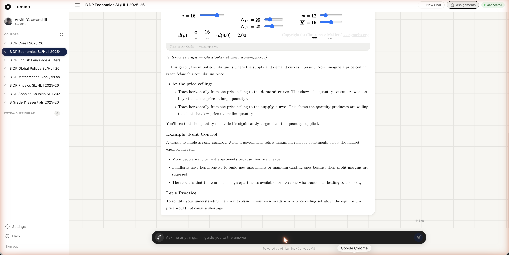
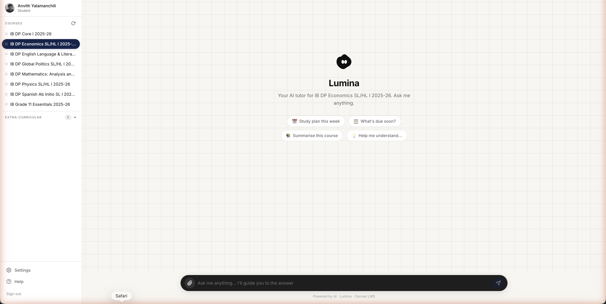
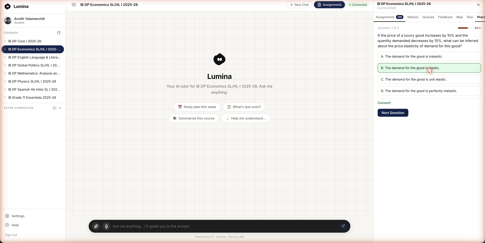
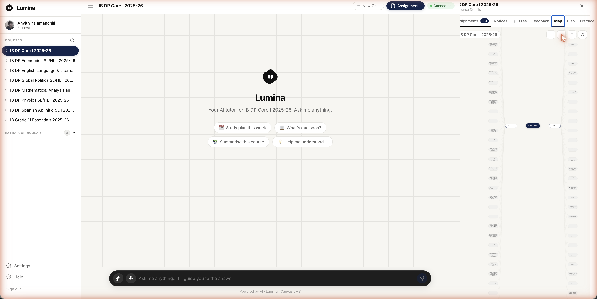
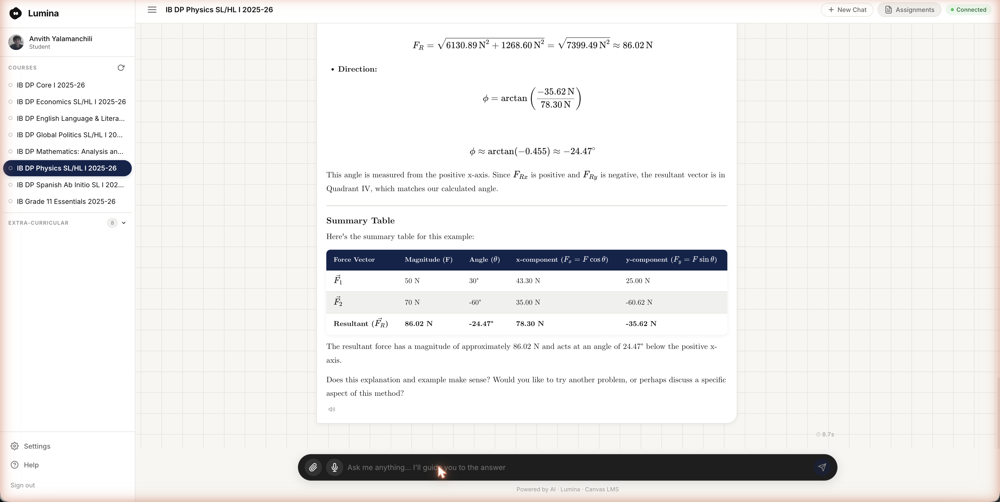

# Lumina V2


> [!NOTE]
> This is **Lumina V2** — the second, production-oriented rebuild (multi-user auth, a persistent Postgres database, a fully swappable AI provider layer). The original hackathon prototype is **[Lumina V1](https://github.com/AYDXB09/school-ai)** (public). This repo is currently **private** and will flip to public once development is further along.

### Contents
[What is Lumina](#what-is-lumina) · [Why Socratic tutoring](#why-socratic-tutoring--not-a-shortcut) · [Screenshots](#screenshots) · [Core Features](#core-features) · [Real Examples](#real-examples) · [Tech Stack](#tech-stack) · [AI Model Notes](#ai-model-notes) · [V1 vs V2](#v1-vs-v2) · [Running Locally](#running-locally) · [License](#license)

## What is Lumina

Lumina is an **AI-powered Socratic tutoring platform** built on top of Canvas LMS — not a Canvas replacement, and not a teacher tool. It's a student study companion, built for the student who's stuck on homework at 11pm with no teacher to ask.

Canvas's own AI (IgniteAI) is teacher-configured and assignment-scoped. Lumina is student-initiated, always-on, and knows the student's full course context — synced assignments, quizzes, calendar, and private study materials they upload themselves.

**Pilot school:** Dwight Global Online School (dwight.instructure.com)

## Why Socratic tutoring — not a shortcut

A generic AI chatbot answers a homework question directly. That's convenient, and it's also exactly the problem: a student who pastes their essay prompt into ChatGPT and gets a finished argument back hasn't learned to construct one themselves. For a school, that's not a tutoring tool — it's an integrity risk wearing a tutoring tool's name.

Lumina is built around a **real rule enforced in the system prompt** (`backend/chat/prompt.py`), not a marketing claim: the AI explicitly distinguishes between two kinds of questions and only two.

- **Factual questions** — exam structure, syllabus dates, definitions, "what's due this week" — get answered **directly and completely**. A student doesn't need to be Socratically interrogated about when their IA is due; they need the date.
- **Problem-solving questions** — "how do I solve this," "why does this happen," "help me understand X" — get **guided, not solved**. The AI asks a leading question, points at the relevant concept, or breaks the problem into a smaller first step, and stops there. It does not write the essay. It does not hand over the derivation. The screenshot above is a real, unedited example of this in action, including the AI ending its own answer by asking the student to demonstrate the reasoning back.

This is enforced structurally, not by hoping the model behaves — the same instruction fires for every subject (12 subject-specific prompt modules, from Economics to Chemistry to English), so a Global Politics question and a Physics question get the same "guide, don't solve" treatment, tuned to that subject's actual command terms and assessment criteria.

**How this compares:**

| | Generic AI chatbot (ChatGPT, etc.) | Canvas IgniteAI | Lumina |
|---|---|---|---|
| Who it's built for | Anyone, any task | Teachers (grading, rubrics, assignment setup) | Students, specifically at the point of being stuck |
| Problem-solving questions | Answers directly — will write the essay, solve the derivation | N/A — not student-facing in this way | Guides with hints; does not hand over the answer |
| Factual questions (dates, syllabus, definitions) | Answers directly, but with no idea what *your* syllabus actually says | N/A | Answers directly, grounded in the real synced Canvas course |
| Knows the student's actual course content | No — works from general web knowledge only | Teacher-side, assignment-scoped | Yes — RAG over synced Canvas materials + the student's own uploaded notes |
| Available at 11pm with no teacher around | Yes, but ungrounded and unmonitored by the school | No — teacher-initiated only | Yes — this is specifically the gap it exists to fill |
| Complements classroom teaching or replaces it | Neither — it's a separate, unsanctioned tool students use anyway | Doesn't touch student-side learning at all | Extends what the teacher already assigned — same syllabus, same course content, guided practice between classes |

The point isn't that Lumina is smarter than ChatGPT — it's that ChatGPT has no idea what was actually taught in this class, and no reason to hold back the answer. Lumina is scoped to the real syllabus and instructed, at the code level, to make the student do the thinking.

## Screenshots

**A real homework question, answered Socratically — not shortcut.** The student asks why a price ceiling causes a shortage. Lumina builds the explanation with an interactive graph and a worked real-world example (rent control), then ends by asking the student to apply the reasoning themselves before moving on — this is the core pedagogical claim in practice, not marketing copy.



**Course-aware from the moment you open a chat.** No "which class is this for?" — the active course is already known, and quick actions are tailored to it.



**Adaptive quiz with persistent mastery tracking.** One question at a time; answering correctly moves the mastery bar immediately (50% → 65% here) and the next question's difficulty adjusts accordingly — and unlike a browser-refresh-resets-everything quiz, this mastery score is saved and picked up again next time.



**Interactive mind map, auto-generated from the actual synced course content.** No manual setup — pure SVG, drag/zoom/pan, built entirely from what's already been synced from Canvas.



**LaTeX rendering is real, not a claim.** Vector notation ($\vec{F}$), subscripts, square roots, and fractions all render as genuine typeset math via KaTeX — this is an actual response, not a mockup.



Also included: a **Notices** tab (teacher announcements), **Feedback** tab (grades + teacher comments), and the Canvas-sourced **Quizzes** tab (distinct from the AI-generated Practice tab above) — straightforward synced-data views, not pictured here.

## Core Features

- **Socratic AI Chat** — guides students to answers through hints and leading questions on problem-solving; answers factual questions (exam structure, dates, syllabus content) directly instead of Socratically deflecting them, since students need information, not a puzzle.
- **Full Canvas context** — syncs courses, assignments, quizzes/exams, and announcements from the student's own Canvas account (their own API key, no admin approval needed), and injects the active course's upcoming work directly into every chat so the AI never has to ask "which assignment?"
- **Cross-course study plans** — a day-by-day schedule generated from every upcoming assignment/exam across *all* enrolled courses at once, not just the active one. The scheduling itself (which days, how many prep sessions per commitment) is deterministic code, not an AI guess — the AI's job is narrower: write the actual task content and a plain-language reason for each slot.
- **Adaptive quiz generator with persistent mastery** — one question at a time, difficulty tied to a mastery score that's saved to the database and updates after every answer (not just React state that resets on refresh).
- **RAG over real course content** — pgvector semantic search over synced Canvas material and student-uploaded documents (PDFs, notes, past papers), so answers are grounded in what the student's own teacher actually assigned.
- **12 subject-specific prompt modules** — Economics (IB + AP, with interactive graphs and custom SVG diagrams), Mathematics, Physics, Chemistry (LaTeX chemistry notation), Biology, English, History, Languages, Psychology, Computer Science, Geography, Global Politics — each lazy-loaded only when that course is active.
- **Full IB Internal Assessment reference** — every IB subject module carries the actual IA criteria (word counts, mark weights, assessment criteria, deadlines, official IB links), so the AI never deflects an IA question back to "ask your teacher."
- **Interactive mind maps** — pure SVG, auto-generated from a course's synced content, with drag/zoom and an "Ask AI about this" shortcut into chat.
- **Voice mode** — free, browser-native mic dictation and per-message read-aloud (no paid speech API).
- **Provider-agnostic AI layer** — switch between K2, OpenRouter, Anthropic, NVIDIA NIM, Groq, or Gemini via one environment variable, no code changes.

## Real Examples

| Feature | What actually happens |
|---|---|
| **Study plan generation** | Reads every assignment/exam due in the next 30 days across all enrolled courses, allocates prep sessions by urgency and type (exam > quiz > assignment), skips days already blocked by a personal calendar event, caps at 3 tasks/day — then one AI call fills in the actual task text and a `reason` per task, plus a plan-level summary explaining the prioritization in plain language. |
| **Adaptive quiz** | Student picks a topic. First question generated at "intermediate" difficulty (no history yet). Answer correctly → mastery moves from 0.5 to 0.65, next question stays intermediate. Three wrong answers in a row → mastery drops to ~0.22, next question is generated at "beginner" difficulty automatically. |
| **Subject-aware formatting** | In an active Chemistry course, the AI is instructed to write `$\ce{2Na(s) + 2H2O(l) -> 2NaOH(aq) + H2(g)}$` (rendered via KaTeX's mhchem extension) instead of plain-text "2Na + 2H2O -> ...". In Biology, species names are required to render as *Escherichia coli*, not plain text. |
| **AP vs. IB Economics** | A course named "AP Macroeconomics" gets College Board exam framing (MCQ + FRQ, point-based grading, "expansionary/contractionary" terminology). A course named "IB Economics SL" gets IB command-term framing (Explain/Evaluate/Discuss) and the full IA commentary-criteria table. Same underlying interactive graphs, different exam coaching. |
| **Calendar-aware answers** | Ask "am I free this weekend?" and the AI checks the actual synced calendar events (personal calendars + Canvas's own auto-generated calendar) for a real answer, not a guess. |

## Tech Stack

**Frontend**
- React 19 + Vite
- KaTeX (+ mhchem extension) for LaTeX math and chemistry notation
- `marked` + DOMPurify for sanitized Markdown rendering
- Pure SVG for mind maps and custom diagrams — no charting/graph library dependency

**Backend**
- Python + FastAPI, served via Uvicorn
- Server-Sent Events (SSE) for streaming chat, with a queue-based heartbeat to survive Railway's proxy timeout
- Supabase (Postgres + pgvector) for all persistence and RAG
- Fernet symmetric encryption for Canvas tokens at rest

**AI**
- Provider abstraction (`backend/providers/ai/`) — K2, OpenRouter, Anthropic, NVIDIA NIM, Groq, Gemini, switchable via one env var
- Currently running: Gemini `gemini-2.5-flash-lite`
- Gemini embedding API for RAG (no local embedding model — faster cold starts, less memory)

**Integrations**
- Canvas LMS REST API — student's own access token, never an admin token
- Resend for transactional email
- iCal parsing for personal calendars + Canvas's auto-generated calendar

## AI Model Notes

The provider layer (`backend/providers/ai/__init__.py`) is a factory that reads `AI_PROVIDER` from the environment and builds the matching provider — every provider implements the same two methods (`stream()` for chat, `complete()` for one-shot structured generation like study plans and quiz questions), so nothing else in the codebase needs to know which model is actually running.

**Why Gemini right now:** free tier via Google AI Studio, fast (`flash-lite`), and its embedding API replaced a local `sentence-transformers` model that was taking ~11 seconds per query on Railway's CPU — Gemini's embedding call takes ~150ms.

**Tool-calling is disabled for Llama/DeepSeek-family models** (`MODELS_WITHOUT_TOOL_SUPPORT` in `chat/engine.py`) — those models get pre-injected context and proactive RAG results instead of the OpenAI-style tool-call loop, so they still work correctly without native tool support.

> [!WARNING]
> **A real production incident worth knowing about:** an earlier version of the Gemini provider passed `extra_body={"thinking": {"type": "disabled"}}` to suppress thinking tokens. Google's OpenAI-compatible endpoint started rejecting that field outright (`400: Unknown name "thinking"`), which silently broke every chat request — both locally and in production — until it was caught and the field was removed. If thinking-token suppression is needed again, check Google's current API docs for the correct field shape first.

## V1 vs V2

| | V1 (school-ai) | V2 (this repo) |
|---|---|---|
| Auth | Single hardcoded API key | Canvas API key per student, JWT + refresh cookie |
| Database | ChromaDB (local, ephemeral) | Supabase Postgres + pgvector (persistent) |
| AI provider | Hardcoded to K2-Think-v2 | 6 providers, swappable via env var |
| Deployment | Local only | Railway, Dockerized, auto-deploys on push |
| Multi-user | No | Yes, per-school multi-tenancy in the schema |
| Study plans | Not built | Cross-course, deterministic scheduling + AI content |
| Adaptive quiz | React-state mastery (resets on refresh) | Persisted mastery via `mastery_scores` table |
| Voice mode | Full hands-free loop (STT→AI→TTS→STT) | Mic dictation + read-aloud primitives (hands-free loop not yet ported) |

## Running Locally

<details>
<summary><strong>Setup instructions</strong> (click to expand) — requires Python 3.12+, Node 20+, and a Supabase project</summary>

```bash
git clone git@github.com:AYDXB09/Lumina-v2.git
cd Lumina-v2

# Backend
cd backend
python3 -m venv venv && source venv/bin/activate
pip install -r requirements.txt
cp .env.example .env   # fill in SUPABASE_URL, SUPABASE_SERVICE_KEY, JWT_SECRET,
                        # ENCRYPTION_KEY, and at least one AI provider's key
python3 main.py         # → http://localhost:8000

# Frontend (separate terminal)
cd frontend
npm install
cp .env.example .env.local
npm run dev              # → http://localhost:5173
```

Or run both together from the repo root:

```bash
./dev.sh
```

Generate the required secrets:

```bash
# JWT_SECRET
openssl rand -hex 32

# ENCRYPTION_KEY
python3 -c "from cryptography.fernet import Fernet; print(Fernet.generate_key().decode())"
```

</details>

## License

MIT — see [LICENSE](./LICENSE).
